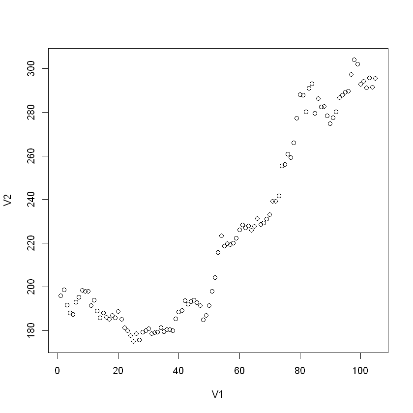
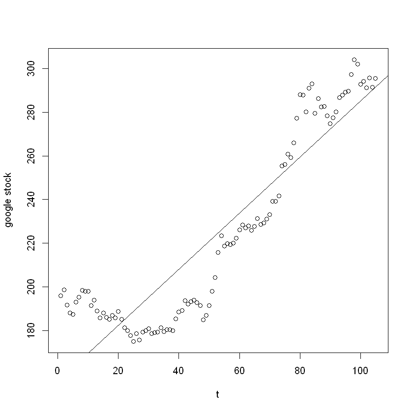

## 读入数据，并将自变量设为1至样本个数


```R
raw_data = read.table("./google_stock.txt")
google12 = raw_data[c(1,2)]
google34 = raw_data[c(3,4)]
google56 = raw_data[c(5,6)]
colnames(google34) = colnames(google12)
colnames(google56) = colnames(google12)
google = rbind(google12, google34, google56)
google$V1 = c(1: nrow(google))
google
```


<table class="dataframe">
<caption>A data.frame: 105 × 2</caption>
<thead>
	<tr><th scope=col>V1</th><th scope=col>V2</th></tr>
	<tr><th scope=col>&lt;int&gt;</th><th scope=col>&lt;dbl&gt;</th></tr>
</thead>
<tbody>
	<tr><td> 1</td><td>196.03</td></tr>
	<tr><td> 2</td><td>198.64</td></tr>
	<tr><td> 3</td><td>191.58</td></tr>
	<tr><td> 4</td><td>187.98</td></tr>
	<tr><td> 5</td><td>187.40</td></tr>
	<tr><td> 6</td><td>192.99</td></tr>
	<tr><td> 7</td><td>195.23</td></tr>
	<tr><td> 8</td><td>198.41</td></tr>
	<tr><td> 9</td><td>197.90</td></tr>
	<tr><td>10</td><td>197.95</td></tr>
	<tr><td>11</td><td>191.37</td></tr>
	<tr><td>12</td><td>193.95</td></tr>
	<tr><td>13</td><td>188.89</td></tr>
	<tr><td>14</td><td>185.87</td></tr>
	<tr><td>15</td><td>187.99</td></tr>
	<tr><td>16</td><td>186.06</td></tr>
	<tr><td>17</td><td>185.18</td></tr>
	<tr><td>18</td><td>187.01</td></tr>
	<tr><td>19</td><td>185.90</td></tr>
	<tr><td>20</td><td>188.81</td></tr>
	<tr><td>21</td><td>185.20</td></tr>
	<tr><td>22</td><td>181.35</td></tr>
	<tr><td>23</td><td>179.98</td></tr>
	<tr><td>24</td><td>177.80</td></tr>
	<tr><td>25</td><td>174.99</td></tr>
	<tr><td>26</td><td>178.61</td></tr>
	<tr><td>27</td><td>175.60</td></tr>
	<tr><td>28</td><td>179.29</td></tr>
	<tr><td>29</td><td>180.04</td></tr>
	<tr><td>30</td><td>180.88</td></tr>
	<tr><td>⋮</td><td>⋮</td></tr>
	<tr><td> 76</td><td>260.81</td></tr>
	<tr><td> 77</td><td>259.20</td></tr>
	<tr><td> 78</td><td>266.00</td></tr>
	<tr><td> 79</td><td>277.27</td></tr>
	<tr><td> 80</td><td>288.00</td></tr>
	<tr><td> 81</td><td>287.90</td></tr>
	<tr><td> 82</td><td>280.26</td></tr>
	<tr><td> 83</td><td>290.94</td></tr>
	<tr><td> 84</td><td>293.12</td></tr>
	<tr><td> 85</td><td>279.56</td></tr>
	<tr><td> 86</td><td>286.31</td></tr>
	<tr><td> 87</td><td>282.50</td></tr>
	<tr><td> 88</td><td>282.75</td></tr>
	<tr><td> 89</td><td>278.35</td></tr>
	<tr><td> 90</td><td>274.80</td></tr>
	<tr><td> 91</td><td>277.44</td></tr>
	<tr><td> 92</td><td>280.30</td></tr>
	<tr><td> 93</td><td>286.70</td></tr>
	<tr><td> 94</td><td>287.84</td></tr>
	<tr><td> 95</td><td>289.30</td></tr>
	<tr><td> 96</td><td>289.71</td></tr>
	<tr><td> 97</td><td>297.25</td></tr>
	<tr><td> 98</td><td>304.10</td></tr>
	<tr><td> 99</td><td>302.00</td></tr>
	<tr><td>100</td><td>292.72</td></tr>
	<tr><td>101</td><td>294.15</td></tr>
	<tr><td>102</td><td>291.25</td></tr>
	<tr><td>103</td><td>295.71</td></tr>
	<tr><td>104</td><td>291.52</td></tr>
	<tr><td>105</td><td>295.54</td></tr>
</tbody>
</table>


## 散点图


```R
plot(google)
```


​    

​    


## 拟合一元线性回归模型


```R
mdl0 = lm(V2~V1, data=google)
summary(mdl0)
```


​    
    Call:
    lm(formula = V2 ~ V1, data = google)
    
    Residuals:
        Min      1Q  Median      3Q     Max 
    -33.297 -13.967   1.335  12.056  39.395 
    
    Coefficients:
                 Estimate Std. Error t value Pr(>|t|)    
    (Intercept) 156.67805    3.52517   44.45   <2e-16 ***
    V1            1.28372    0.05774   22.23   <2e-16 ***
    ---
    Signif. codes:  0 '***' 0.001 '**' 0.01 '*' 0.05 '.' 0.1 ' ' 1
    
    Residual standard error: 17.93 on 103 degrees of freedom
    Multiple R-squared:  0.8276,	Adjusted R-squared:  0.8259 
    F-statistic: 494.3 on 1 and 103 DF,  p-value: < 2.2e-16


## 画出拟合直线


```R
plot(google$V1, google$V2,
xlab = "t", ylab = "google stock")
abline(mdl0)
```


​    

​    


## 利用Durbin-Watson检验判断序列自相关性


```R
library(lmtest)
dwtest(mdl0)
```


​    
    	Durbin-Watson test
    
    data:  mdl0
    DW = 0.061858, p-value < 2.2e-16
    alternative hypothesis: true autocorrelation is greater than 0


```R
dw0 = as.numeric(dwtest(mdl0)$statistic) # 将dw统计量保存到变量dw0里, 计算迭代法时需要用来估计rho
dw0
```


0.0618582452309325


## DW检验结果
$DW = 0.061858$  
$p-value < 2.2e-16$ 存在正自相关

## 利用迭代法处理自相关
首先假设模型存在一阶自相关  
需要做变换$y_t' = y_t - \rho y_{t - 1}$和$x_t' = x_t - \rho x_{t - 1}$  
$\rho$值不知道，用$1-dw/2$来估计


```R
rho0 = 1-dw0/2 # 用1-dw/2来估计rho
n0 = nrow(google) # 样本个数
y0 = google$V2
x0 = google$V1
y1 = y0[2:n0]-rho0*y0[1:n0-1] # 变换后的因变量, 共n0-1个
x1 = x0[2:n0]-rho0*x0[1:n0-1] # 变换后的自变量, 共n0-1个
mdl1 <- lm(y1~x1) # 用变换后的变量建立一元线性回归模型
summary(mdl1)
```


​    
    Call:
    lm(formula = y1 ~ x1)
    
    Residuals:
         Min       1Q   Median       3Q      Max 
    -14.3720  -2.6945  -0.2969   2.4957  12.1304 
    
    Coefficients:
                Estimate Std. Error t value Pr(>|t|)    
    (Intercept)    2.522      1.272   1.983   0.0501 .  
    x1             2.045      0.457   4.474    2e-05 ***
    ---
    Signif. codes:  0 '***' 0.001 '**' 0.01 '*' 0.05 '.' 0.1 ' ' 1
    
    Residual standard error: 4.327 on 102 degrees of freedom
    Multiple R-squared:  0.1641,	Adjusted R-squared:  0.1559 
    F-statistic: 20.02 on 1 and 102 DF,  p-value: 1.998e-05


## 利用DW检验判断迭代一次后的模型的自相关性


```R
dwtest(mdl1)
dw1 = dwtest(mdl1)$statistic
dw1
```


​    
    	Durbin-Watson test
    
    data:  mdl1
    DW = 1.8973, p-value = 0.2644
    alternative hypothesis: true autocorrelation is greater than 0


<strong>DW:</strong> 1.89732294556596


$DW = 1.8973, p-value = 0.2644$  
$p > 0.05$, 没有自相关  
迭代法结束

## 迭代一次后的模型估计值
$\beta_0'=2.522,\ \ \beta_1' = 2.045, \hat{\rho} = 0.969$  
根据变换前后模型系数的关系：$\beta_0' = \beta_0(1-\rho), \beta_1' = \beta_1$，可以计算原模型的系数估计值


```R
b0 = 2.522 / (1-rho0)
b1 = 2.045
b0
b1
```

81.5412720029396

2.045


## 原一元线性回归方程为  
$y = 81.541 + 2.045x$
